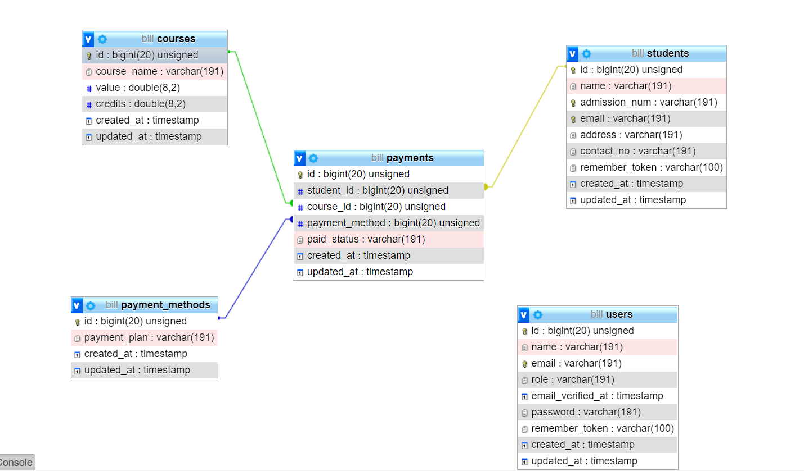

Setting up your development environment on your local machine :

$ git clone https://bitbucket.org/DulanN/school_billing

composer update

php artisan key:generate

php artisan migrate --seed

php artisan serve

